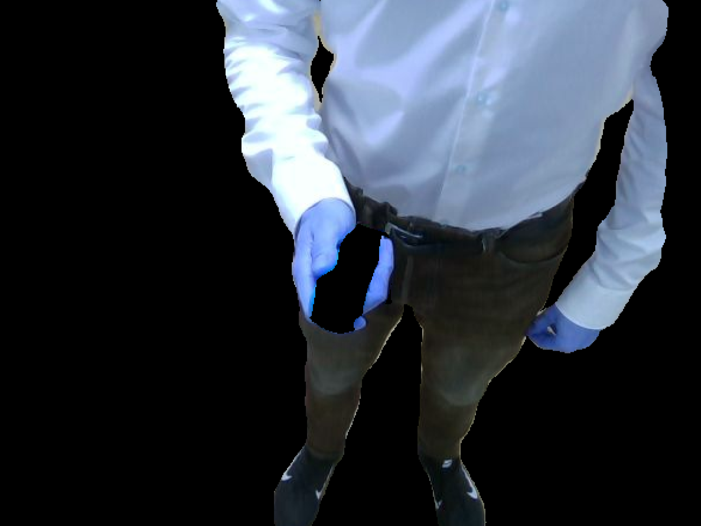
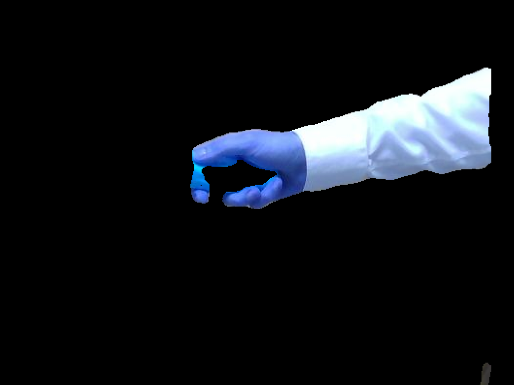

# ROS node for real-time bodyparts detection #

This is a ROS implementation of the light-weight RefineNet neural network trained on the bodyparts data set. The NN is capable of detecting human body parts and can differentiate between heads, torsos, upper arms, lower arms, upper legs, and lower legs with a mean intersection-over-union (IoU) score of 0.649 ([Nek18](https://github.com/DrSleep/light-weight-refinenet)).

This node is part of a larger project with the objective to enable object-independent human-to-robot handovers using robotic vision. The code for this project can be found [here](https://github.com/patrosAT/human_robot_handover_ros).

The node can be implemented as publisher, service, or action. See below for more inforamtion.

* **Input:** RGB image: [sensor_msgs/CompressedImage](http://docs.ros.org/melodic/api/sensor_msgs/html/msg/CompressedImage.html)
* **Output:** Mask (0 background, 1-6 bodyparts): [sensor_msgs/CompressedImage](http://docs.ros.org/melodic/api/sensor_msgs/html/msg/CompressedImage.html)

<b>Example from a frontal perspective (full body):</b>

<b>Example from a lateral perspective (arm and hand only):</b>

## Getting Started ##

The code have been tested with Python 2.7 and 3.6.

### Hardware ###

* RGB camera (e.g. realsense)
* *Recommended:* GPU >= 2 GB

### Software ###

**NOT AVAILABLE > COMMING SOON**

* Python 2.x: see [requirements.txt](requirements.txt)
* Python 3.x: see [requirements3.txt](requirements3.txt)

## Configuration ##

The initial configuration can be changed by adapting the [bodyparts.yaml](cfg/bodyparts.yaml) file:

#### Camera ####
* **topic:** Rostopic the publisher node is subcribing to.

#### Interfaces ####
* **topic:** Rostopic the publisher node is publishing to *(please do not change)*.
* **service:** Rosservice for interacting with the service node *(please do not change)*.
* **action:** Rostopic for interacting with the action node *(please do not change)*.

#### Visualization ####

The visualization mode published the original image with the background blacked out. Please be aware that turing on the visualization increases computing time and network utilization substantially.

* **topic:** Topic the node is publishing to.
* **activated:** Turn on/off visualization: *use keywords "on" or "off"*.

#### GPU ###
* **gpu:** Number of the gpu.

#### Model ###
* **model:** Number of NN-layers: *use keywords "50", "101" or "152"*

### Launch ###

The ros package contains 3 launch files:
* **Publisher:** The [publisher](launch/bodyparts_publisher.launch) launch file starts a ros node that published a new mask every time a new rgb image is published.
* **Serivce:** The [serivce](launch/bodyparts_service.launch) launch file starts a ros service. 
* **Action:** The [action](launch/bodyparts_action.launch) launch file starts a ros action server.

## Acknowledgments

The ROS node is powered by the pytorch implementation of [DrSleep](https://github.com/DrSleep). For more information on RefineNet please refer to the original [paper](https://arxiv.org/abs/1611.06612) or the following [github repository](https://github.com/DrSleep/light-weight-refinenet)

## License

* **Academic:** This project is licensed under the 4-clause BSD License.
* **Commercial:** Please contact the author.
